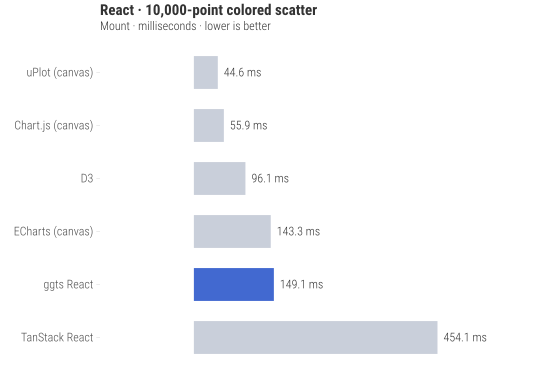
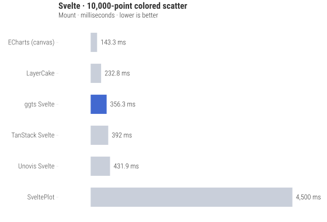

# ggts

Formerly ggsvelte. [Migration guide](https://ggts.sh/guide/upgrading#0-42-to-0-43).

[](https://github.com/ggts-sh/ggts/actions/workflows/ci.yml)
[](https://www.npmjs.com/package/@ggts-sh/svelte)
[](https://app.codecov.io/gh/ggts-sh/ggts)
[](LICENSE)

ggplot2’s grammar for TypeScript, built for coding agents. Generate and check
charts in a sandbox, then use the same spec in React or Svelte.

[Documentation](https://ggts.sh/) · [Agent setup](https://ggts.sh/guide/agents) ·
[Examples](https://ggts.sh/examples) · [Framework quickstarts](https://ggts.sh/guide/getting-started)

## Start in an agent sandbox

```sh
npm install --save-dev --save-exact @ggts-sh/cli @ggts-sh/skill
```

Keep the lockfile and tell your agent to read
`node_modules/@ggts-sh/skill/SKILL.md`. If you copy the package into the
agent’s skills directory, refresh that copy after each dependency update.
The skill shares one grammar and selects React or Svelte instructions from
the target application.

Try this task:

> Make a column chart of annual sales: 2023: 12, 2024: 18, 2025: 25.
> Save a complete PortableSpec as chart.json. Run `ggts check`, read its
> diagnostics, fix errors, and render chart.svg.

A complete `chart.json`:

```json
{
  "data": {
    "values": [
      { "year": "2023", "sales": 12 },
      { "year": "2024", "sales": 18 },
      { "year": "2025", "sales": 25 }
    ]
  },
  "aes": { "x": { "field": "year" }, "y": { "field": "sales" } },
  "layers": [{ "geom": "col" }],
  "scales": { "x": { "type": "band" } },
  "labs": { "title": "Annual sales", "x": "Year", "y": "Sales" }
}
```

```sh
npm exec -- ggts check chart.json
npm exec -- ggts render chart.json > chart.svg
```

`check` runs the rendering checks without SVG output. Both commands write
JSONL diagnostics to stderr; validation errors include a path and suggested
fix. Inspect the SVG after the checks pass. No browser or UI framework is
required for this workflow.

[Complete sandbox setup and repair loop](https://ggts.sh/guide/agents) ·
[Schema](https://ggts.sh/schema/v0.json) · [llms.txt](https://ggts.sh/llms.txt) ·
[Full corpus](https://ggts.sh/llms-full.txt)

## Use React or Svelte

```sh
npm install @ggts-sh/react   # React DOM 18.2 or 19
# or
npm install @ggts-sh/svelte  # Svelte 5.33.1+
```

Pass the same spec to `GGPlot`, calling `registerAll()` once for spec-driven
charts. Or compose `GeomPoint`, `GeomSmooth`, scales, themes, and other
layers as components. The TypeScript `gg()` builder produces the same spec.
[Complete React and Svelte examples](https://ggts.sh/guide/getting-started).

Node.js 22+; CI tests npm, pnpm, and Bun. Interactive charts also need browser
checks for callbacks, keyboard use, and hydration.

## Packages

| Package                                | Surface                                                                      |
| -------------------------------------- | ---------------------------------------------------------------------------- |
| [`@ggts-sh/spec`](packages/spec)       | PortableSpec, schema, validation, normalization, TypeScript builder          |
| [`@ggts-sh/core`](packages/core)       | Shared pipeline, headless SVG, canvas, hit testing; teaching data at `/data` |
| [`@ggts-sh/react`](packages/react)     | React DOM components                                                         |
| [`@ggts-sh/svelte`](packages/svelte)   | Svelte 5 components                                                          |
| [`@ggts-sh/compose`](packages/compose) | Shared grammar composition                                                   |
| [`@ggts-sh/cli`](packages/cli)         | `ggts check` and `ggts render`                                               |
| [`@ggts-sh/skill`](packages/skill)     | Versioned agent skill and framework references                               |

## Framework benchmarks

[Full results and methodology](https://ggts.sh/benchmarks) separate the
core renderer, React, and Svelte. Fixed workloads retain every measured
comparator, including results where another library wins.

<!-- framework-benchmark-charts:start -->





<!-- framework-benchmark-charts:end -->

## Why ggts?

Svelte ecosystem comparison. For React timings and all measured surfaces, see
[the full benchmark results](https://ggts.sh/benchmarks).

| Capability                                       | ggts       | TanStack | SveltePlot | Unovis   | LayerCake |
| ------------------------------------------------ | ---------- | -------- | ---------- | -------- | --------- |
| **Bundle size** (min+gzip, scatter import graph) | ⚠️ 273 KB  | ✅ 57 KB | ⚠️ 109 KB  | ✅ 80 KB | ✅ 41 KB  |
| **API stability**                                | ⚠️ v0.43.0 | ⚠️ v0.14 | ⚠️ v0.14   | ✅ v1.6  | ✅ v10    |
| **Headless server-side SVG** (no DOM)            | ✅         | ✅       | ❌         | ❌       | ⚠️ opt-in |
| **Portable JSON spec + schema**                  | ✅         | ❌       | ❌         | ❌       | ❌        |
| **CLI validator + renderer**                     | ✅         | ❌       | ❌         | ❌       | ❌        |
| **Agent skill**                                  | ✅         | ✅       | ❌         | ❌       | ❌        |
| **Automatic temporal detection**                 | ✅         | ❌       | ⚠️ Some    | ❌       | ❌        |
| **Built-in interactions**                        | ✅         | ✅       | ⚠️ Some    | ⚠️ Some  | ❌        |
| **ggplot2 API**                                  | ✅         | ❌       | ❌         | ❌       | ❌        |
| **Scale, axis & coord control**                  | ✅         | ✅       | ✅         | ✅       | ⚠️ d3     |

## Reference

- [Guide](https://ggts.sh/docs)
- [Example gallery](https://ggts.sh/examples)
- [Themes and palettes](https://ggts.sh/themes)
- [Interactions and events](https://ggts.sh/reference/interactions)
- [Production](https://ggts.sh/guide/production)
- [Upgrading](https://ggts.sh/guide/upgrading)

## Release status

Pre-1.0. Package manifests are the version source of truth. Lifecycle and
compatibility contracts live in [`lifecycle.json`](lifecycle.json) and the
[lifecycle guide](https://ggts.sh/guide/lifecycle).

## Contributing

See [CONTRIBUTING.md](CONTRIBUTING.md).

## License

[MIT](LICENSE) © Liam O'Dea. Loess reference attribution is in [NOTICE](NOTICE).
